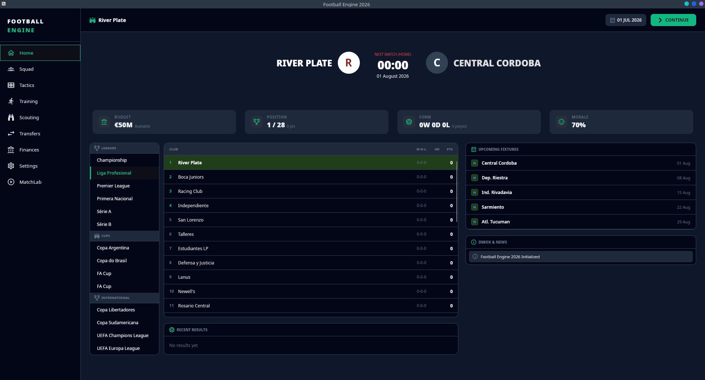
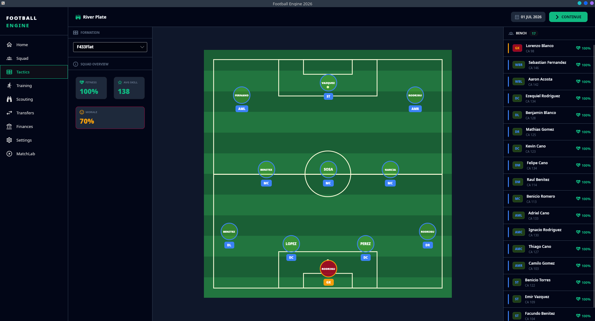
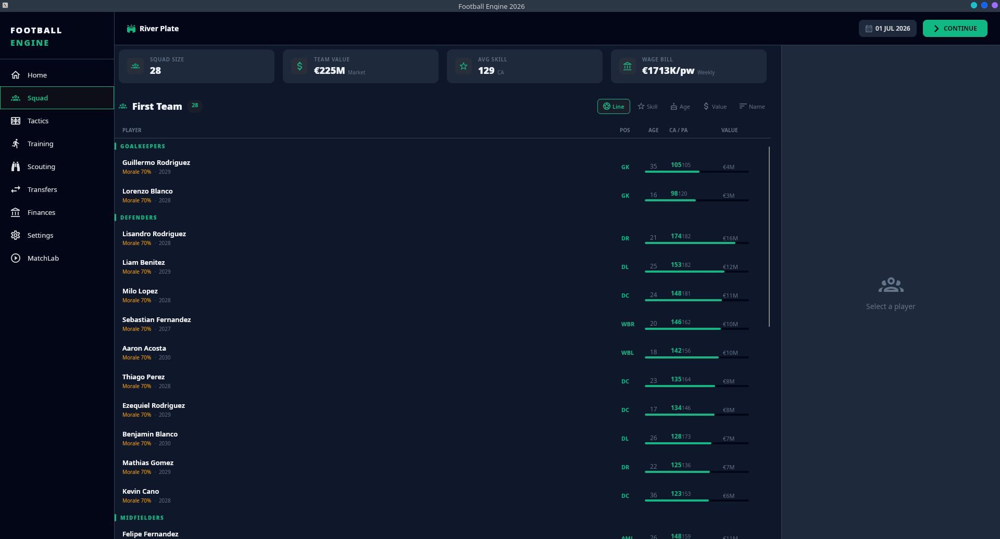
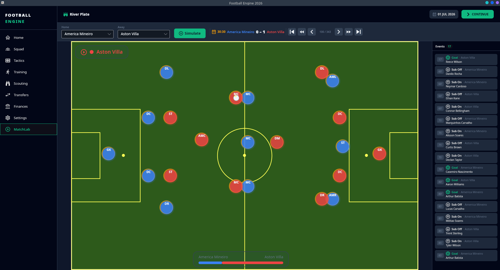

# FootballEngine

A Football Manager-style game built in F#. Work in progress.

## Screenshots





## Stack

F# · Avalonia FuncUI · Elmish · SQLite

## What works so far

- Match simulation engine (event loop, fatigue, duels, shots)
- Home, Squad, Tactics and Match Viewer pages
- Leagues from Argentina, England, Spain and Brazil
- Save/load game state

## What's missing

- Several pages still in progress
- No AI manager
- Training and finances not implemented yet

## Run it
```bash
dotnet restore
dotnet run --project FootballEngine.Client
```

Requires .NET 10 SDK.

## License

MIT